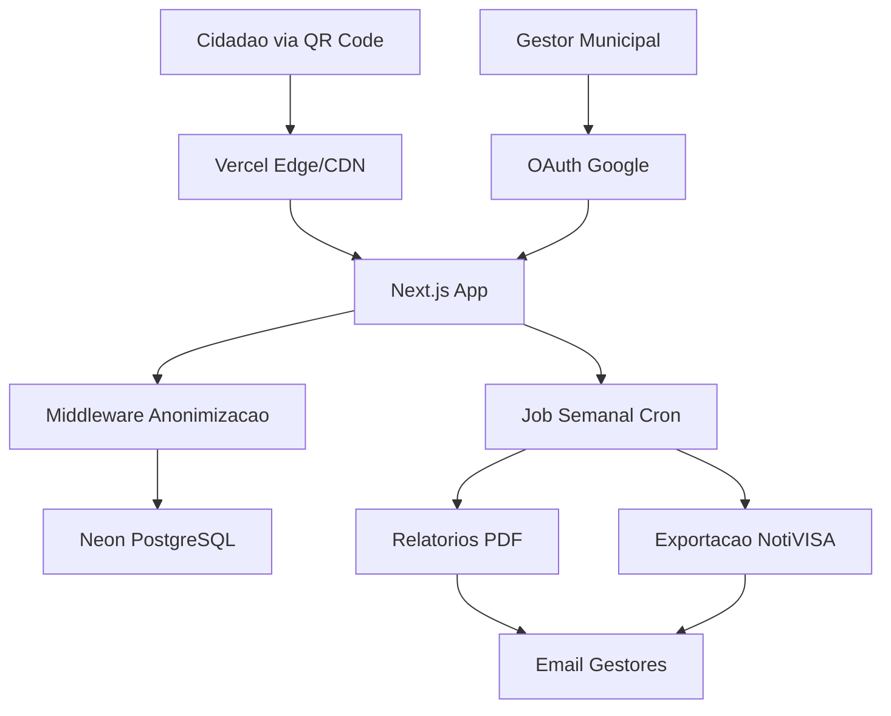
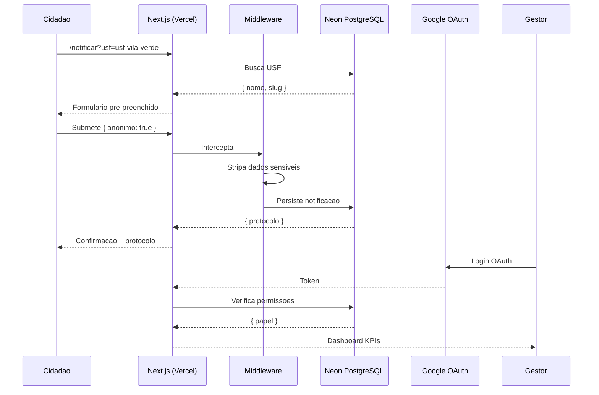

# NotificaSUS Fullstack Architecture Document

**Versao:** 1.2
**Data:** 2026-07-30
**Autor:** @architect (Aria)
**Status:** Active (v1.0 deployed at https://notificasus.vercel.app)

## 1. Introduction

Este documento define a arquitetura completa do NotificaSUS, incluindo backend, frontend e infraestrutura. Serve como fonte unica de verdade para o desenvolvimento orientado por IA.

### Starter Template
N/A — Greenfield project.

### Change Log
| Data | Versao | Descricao | Autor |
|------|--------|-----------|-------|
| 2026-07-28 | 1.0 | Versao inicial da arquitetura | @architect (Aria) |
| 2026-07-29 | 1.1 | Deploy Vercel + Neon + Google OAuth configurados; Epic 3 (graficos Recharts, exportacao CSV/JSON, anonimizacao exportacao, RBAC) documentado | @dev |
| 2026-07-30 | 1.2 | Login OAuth confirmado funcional; crash dashboard corrigido (safe defaults + componentes defensivos); allowlist adicionada; signIn callback em bypass temporario | @dev |

## 2. High Level Architecture

### Technical Summary
Arquitetura serverless fullstack com Next.js (App Router) + PostgreSQL serverless (Neon), hospedada na Vercel. O sistema tera dois segmentos isolados: (1) formulario publico em `pinhais.pr.gov.br/notificar` para notificacao anonima via QR Code, e (2) dashboard gerencial em `gestao.pinhais.pr.gov.br` protegido por OAuth Google. O middleware de anonimizacao atua como gateway antes da persistencia, garantindo conformidade LGPD.

### Platform & Infrastructure
**Plataforma:** Vercel + Neon (PostgreSQL serverless)
**Servicos:** Next.js (Vercel), PostgreSQL (Neon), NextAuth (OAuth Google)
**Deploy:** Vercel (automatico via GitHub)

### Repository Structure
**Monorepo** com Next.js App Router — formulario e dashboard no mesmo app com rotas separadas.

### Architecture Diagram



### Architectural Patterns
- **Serverless Functions:** API routes do Next.js como backend
- **Middleware Pattern:** Middleware de anonimizacao antes do banco
- **Repository Pattern:** Abstração de acesso a dados (Drizzle)
- **RBAC via OAuth:** Controle de acesso ao dashboard via claims Google
- **BFF:** API routes do Next.js atuam como BFF

## 3. Tech Stack

| Categoria | Tecnologia | Versao | Proposito |
|-----------|-----------|--------|-----------|
| Frontend Framework | Next.js (App Router) | 16.2.12 | SSR + API routes + Vercel deploy |
| Linguagem | TypeScript | 5.x | Tipagem estatica fullstack |
| CSS | Tailwind CSS | 4.x | Utilitario, responsivo, leve |
| Database | Neon (PostgreSQL) | 16 | Persistencia serverless |
| ORM | Drizzle | 0.45.2 | Type-safe queries |
| Auth | NextAuth v5 | 5.0.0-beta.32 | OAuth Google Workspace |
| Graficos | Recharts | 3.10.1 | Componentes de grafico para dashboard |
| Data Fetching | @tanstack/react-query | 5.101.4 | Cache e fetching de dados do dashboard |
| PDF | Puppeteer | — | Relatorios mensais (futuro) |
| Testes | Vitest + @testing-library/react | 4.x + 16.x | Unitarios, integracao |
| Monitoramento | Sentry | — | Erros e performance (futuro) |

## 4. Data Models

### USF (Unidade de Saude da Familia)
- `id`: UUID — identificador unico
- `slug`: VARCHAR(50) — identificador amigavel para URL
- `nome`: VARCHAR(200) — nome oficial
- `endereco`: TEXT — endereco completo
- `ativo`: BOOLEAN — ativa para notificacoes

### Notificacao
- `id`: UUID — identificador unico
- `protocolo`: VARCHAR(20) — hash publico (ex: NOT-20260728-A3F2)
- `usf_id`: UUID FK — referencia a USF
- `tipo_incidente`: VARCHAR(100) — categoria compativel NotiVISA
- `data_hora`: TIMESTAMPTZ — data/hora do incidente
- `descricao`: TEXT — descricao do ocorrido
- `grau_dano`: ENUM(leve, moderado, grave, obito)
- `classificacao_incidente`: VARCHAR(50) NULL — classificacao do incidente (ex: "confirmado", "suspeito", "near_miss") — *adicionado Epic 3*
- `local_especifico`: VARCHAR(100) NULL — local especifico na USF (ex: "sala_vacina", "recepcao") — *adicionado Epic 3*
- `severidade`: VARCHAR(50) NULL — severidade do incidente (ex: "baixa", "media", "alta", "critica") — *adicionado Epic 3*
- `acoes_tomadas`: TEXT — acoes imediatas
- `anonimo`: BOOLEAN — registro anonimo
- `created_at`: TIMESTAMPTZ

### Historico Comissao (futuro Epic 4)
- `id`: UUID
- `notificacao_id`: UUID FK — referencia a notificacao
- `usuario_id`: UUID FK — referencia ao usuario da comissao
- `acao`: VARCHAR(50) — validar, reclassificar, confirmar_severidade
- `classificacao_anterior`: VARCHAR(50)
- `classificacao_nova`: VARCHAR(50)
- `severidade_anterior`: VARCHAR(50)
- `severidade_nova`: VARCHAR(50)
- `observacao`: TEXT
- `created_at`: TIMESTAMPTZ

### Usuario (Dashboard)
- `id`: UUID
- `email`: VARCHAR(255) — @pinhais.pr.gov.br
- `nome`: VARCHAR(200)
- `papel`: ENUM(admin, gestor, visualizador)
- `created_at`: TIMESTAMPTZ

## 5. Database Schema

```sql
CREATE TABLE usf (
    id UUID PRIMARY KEY DEFAULT gen_random_uuid(),
    slug VARCHAR(50) UNIQUE NOT NULL,
    nome VARCHAR(200) NOT NULL,
    endereco TEXT,
    ativo BOOLEAN DEFAULT true,
    created_at TIMESTAMPTZ DEFAULT now()
);

CREATE TABLE notificacao (
    id UUID PRIMARY KEY DEFAULT gen_random_uuid(),
    protocolo VARCHAR(20) UNIQUE NOT NULL,
    usf_id UUID NOT NULL REFERENCES usf(id),
    tipo_incidente VARCHAR(100) NOT NULL,
    data_hora TIMESTAMPTZ NOT NULL,
    descricao TEXT NOT NULL,
    grau_dano VARCHAR(20) NOT NULL CHECK (grau_dano IN ('leve','moderado','grave','obito')),
    classificacao_incidente VARCHAR(50) NULL,
    local_especifico VARCHAR(100) NULL,
    severidade VARCHAR(50) NULL,
    acoes_tomadas TEXT,
    anonimo BOOLEAN DEFAULT true,
    created_at TIMESTAMPTZ DEFAULT now()
);

CREATE TABLE usuario (
    id UUID PRIMARY KEY DEFAULT gen_random_uuid(),
    email VARCHAR(255) UNIQUE NOT NULL,
    nome VARCHAR(200) NOT NULL,
    papel VARCHAR(20) NOT NULL DEFAULT 'gestor'
        CHECK (papel IN ('admin','gestor','visualizador')),
    created_at TIMESTAMPTZ DEFAULT now()
);

CREATE INDEX idx_notificacao_usf_id ON notificacao(usf_id);
CREATE INDEX idx_notificacao_created_at ON notificacao(created_at);
CREATE INDEX idx_notificacao_grau_dano ON notificacao(grau_dano);
CREATE INDEX idx_notificacao_tipo_incidente ON notificacao(tipo_incidente);
CREATE INDEX idx_usf_slug ON usf(slug);
```

## 6. API Specification

### Endpoints Publicos
- `POST /api/notificar` — Criar notificacao (anonima ou identificada)
- `GET /api/usf` — Listar USFs ativas

### Endpoints Protegidos (Dashboard)
- `GET /api/gestao/dashboard/kpis` — KPIs do dashboard (legado)
- `GET /api/gestao/dashboard/graficos` — Dados agregados para graficos estratificados (por USF, tipo, classificacao, severidade, volume temporal)
- `GET /api/gestao/exportar/dados` — Exportar dados CSV/JSON com anonimizacao LGPD (RBAC: visualizador bloqueado)

### Autenticacao
OAuth 2.0 com Google Workspace, restrito a @pinhais.pr.gov.br + allowlist (lincoln.americo@gmail.com).
signIn callback atualmente em bypass temporário (return true) durante depuração.

## 7. Project Structure

```
notificasus/
├── .github/workflows/         # CI/CD (futuro)
├── src/
│   ├── app/
│   │   ├── notificar/
│   │   │   ├── page.tsx        # Formulario publico (step 1-3)
│   │   │   ├── types.ts        # Tipos compartilhados
│   │   │   └── confirmacao/
│   │   │       └── page.tsx    # Tela de confirmacao com protocolo
│   │   ├── gestao/
│   │   │   ├── login/
│   │   │   │   └── page.tsx    # Login OAuth Google
│   │   │   ├── dashboard/
│   │   │   │   └── page.tsx    # Dashboard com KPIs e graficos
│   │   │   └── layout.tsx      # Layout protegido do dashboard
│   │   └── api/
│   │       ├── notificar/
│   │       │   └── route.ts    # POST
│   │       ├── usf/
│   │       │   └── route.ts    # GET
│   │       ├── auth/
│   │       │   └── [...nextauth]/
│   │       │       └── route.ts
│   │       └── gestao/
│   │           ├── dashboard/
│   │           │   ├── kpis/
│   │           │   │   └── route.ts     # KPIs (legado)
│   │           │   └── graficos/
│   │           │       └── route.ts     # Dados p/ graficos
│   │           └── exportar/
│   │               └── dados/
│   │                   └── route.ts     # Exportacao CSV/JSON
│   ├── components/
│   │   ├── formulario/
│   │   │   ├── formulario-notificacao.tsx
│   │   │   ├── indicador-progresso.tsx
│   │   │   ├── passo-tipo-incidente.tsx
│   │   │   ├── passo-descricao.tsx
│   │   │   ├── passo-revisao.tsx
│   │   │   ├── toggle-anonimo.tsx
│   │   │   └── types.ts
│   │   ├── dashboard/
│   │   │   ├── header.tsx
│   │   │   ├── kpi-card.tsx
│   │   │   ├── total-notificacoes.tsx
│   │   │   ├── por-usf.tsx
│   │   │   ├── por-gravidade.tsx
│   │   │   ├── por-tipo.tsx
│   │   │   ├── volume-temporal.tsx
│   │   │   ├── dashboard-filtros.tsx
│   │   │   ├── dashboard-skeleton.tsx
│   │   │   ├── grafico-barras.tsx       # Recharts
│   │   │   ├── grafico-pizza.tsx        # Recharts
│   │   │   ├── grafico-linha.tsx        # Recharts
│   │   │   ├── painel-exportacao.tsx    # Exportacao com confirmacao LGPD
│   │   │   └── types.ts
│   │   └── ui/
│   │       ├── consentimento-lgpd.tsx
│   │       └── loading-skeleton.tsx
│   ├── lib/
│   │   ├── db/
│   │   │   ├── index.ts                 # Conexao Neon
│   │   │   ├── schema.ts                # Drizzle schema
│   │   │   └── __tests__/
│   │   │       └── usf.test.ts
│   │   ├── auth/
│   │   │   └── auth.ts                  # NextAuth config
│   │   ├── middleware/
│   │   │   ├── anonimizacao.ts          # LGPD + exportacao
│   │   │   └── __tests__/
│   │   │       └── anonimizacao.test.ts
│   │   └── services/
│   │       ├── agregacao.ts             # Queries agregadas p/ graficos
│   │       └── exportacao.ts            # CSV/JSON com anonimizacao
│   ├── types/
│   │   └── index.ts
│   └── utils/
│       └── protocolo.ts
├── middleware.ts                        # Protecao rotas gestao
├── drizzle/
│   └── 0000_abandoned_betty_ross.sql    # Migracao unica
├── docs/
│   ├── prd.md
│   ├── architecture.md
│   ├── brainstorming/
│   ├── stories/
│   ├── qa/gates/
│   └── epic3/spec/ + plan/
├── .env.example
├── .env.local                           # Nao comitar
├── vercel.json
├── next.config.ts
├── package.json
└── tsconfig.json
```

## 8. Security & Performance

### Middleware de Anonimizacao (LGPD)
- Pipeline: requisicao -> middleware -> strips dados -> banco
- Modo anonimo: IP, user-agent, headers identificaveis descartados
- `anonimizar()` — strips dados sensiveis antes da persistencia
- `anonimizarExportacao()` — strips nome_paciente, codigo_winsaude, data_nascimento, cpf, rg, telefone, email, endereco
- `anonimizarListaExportacao()` — aplica a uma lista de registros
- Termo de consentimento exibido antes da submissao (checkbox obrigatorio)
- Exportacao com checkbox confirmacao LGPD obrigatorio
- Sem logging de dados sensiveis em modo anonimo - zero console.log

### RBAC (Exportacao)
- **admin:** Acesso total
- **gestor:** Pode exportar
- **visualizador:** Bloqueado de exportar (EC-5), botao desabilitado com tooltip

### Performance
- SSR via Next.js com resposta rapida
- Bundle pequeno (< 100kb JS para o formulario)
- Dashboard com React Query (cache + refresh)
- Graficos com Recharts (SVG, leve)
- Indexes nas colunas de busca principais

## 9. Testing Strategy

- **Unitarios (Vitest):** Middleware anonimizacao (7 testes), formulario (10 testes), API routes, geracao protocolo, servico agregacao, servico exportacao
- **Integracao:** Endpoints API, fluxo completo notificacao, fluxo dashboard/graficos, fluxo exportacao com RBAC
- **LGPD Suite:** Validacao automatizada de anonimizacao na exportacao (4 testes), sanitizacao payload (3 testes)
- **Total:** 11 arquivos de teste, 81+ testes passando
- **Pendente:** Carga (k6), E2E (Playwright), testes de componente (futuro)

## 10. Deployment Configuration

### Vercel (2026-07-29)
- Projeto: `gegpo/notificasus`
- URL: https://notificasus.vercel.app
- Repo: https://github.com/lincolnamerico/NotificaSUS
- Framework: Next.js 16.2.12 (auto-detectado)
- Build: `next build` (Turbopack)
- Build Cache: Habilitado (builds incrementais ~30s)
- Regiao: Washington, D.C., USA (East) - iad1

### Config (vercel.json)
```json
{
  "framework": "nextjs",
  "buildCommand": "next build",
  "outputDirectory": ".next",
  "installCommand": "npm install"
}
```

### Environment Variables (Production)
| Variavel | Valor / Origem |
|----------|---------------|
| DATABASE_URL | Neon PostgreSQL |
| AUTH_SECRET | (gerado via npx auth secret, no .env.local) |
| AUTH_GOOGLE_ID | Google Cloud Console |
| AUTH_GOOGLE_SECRET | Google Cloud Console |
| AUTH_URL | `https://notificasus.vercel.app` (adicionado 2026-07-30) |

### Neon Database
- Host: (configurado no .env.local e Vercel)
- Database: neondb
- User: neondb_owner
- SSL: require (verify-full)
- Schema: Drizzle (aplicado via migration 0000_abandoned_betty_ross.sql)

### Migration
- Arquivo: `drizzle/0000_abandoned_betty_ross.sql`
- Comando: `npx drizzle-kit push`
- Driver: pg (local), @neondatabase/serverless (runtime)

### Google OAuth
- Client ID: (configurado no .env.local e Vercel)
- Redirect URI: https://notificasus.vercel.app/api/auth/callback/google
- Dominio restrito: @pinhais.pr.gov.br + allowlist lincoln.americo@gmail.com
- Console: https://console.cloud.google.com/apis/credentials
- AUTH_URL: https://notificasus.vercel.app (adicionado 2026-07-30)
- signIn callback: atualmente bypassado (return true) — reativar allowlist na proxima sessao

## 11. Core Workflows


