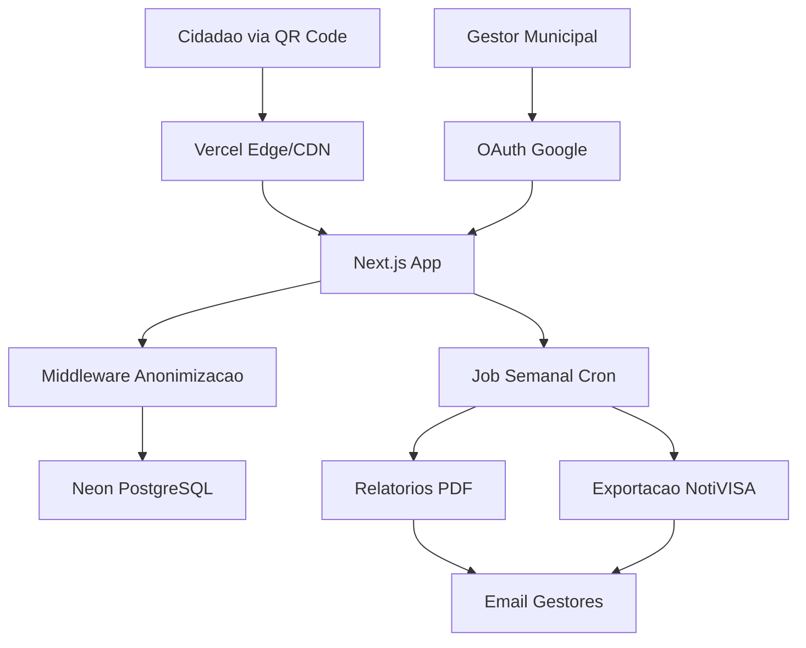
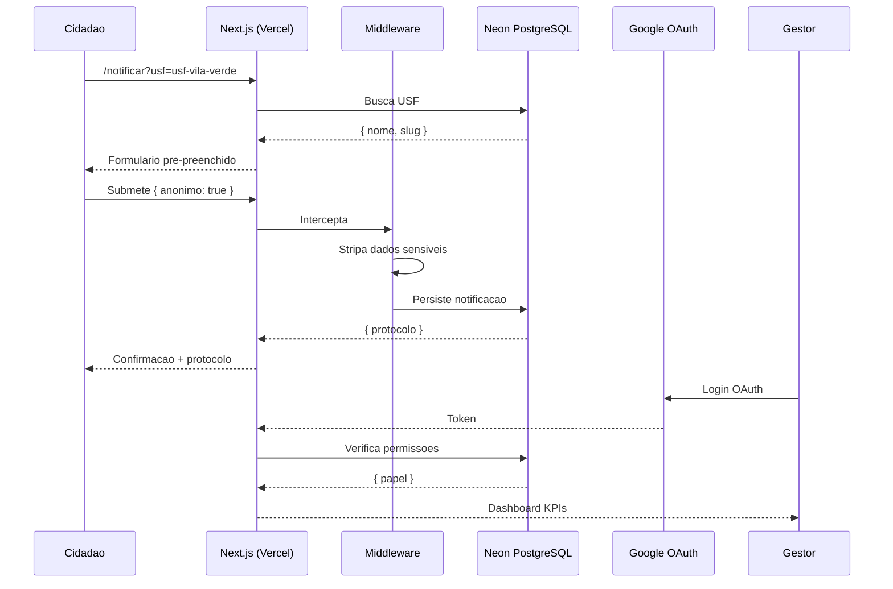

# NotificaSUS Fullstack Architecture Document

**Versao:** 1.0
**Data:** 2026-07-28
**Autor:** @architect (Aria)
**Status:** Draft

## 1. Introduction

Este documento define a arquitetura completa do NotificaSUS, incluindo backend, frontend e infraestrutura. Serve como fonte unica de verdade para o desenvolvimento orientado por IA.

### Starter Template
N/A — Greenfield project.

### Change Log
| Data | Versao | Descricao | Autor |
|------|--------|-----------|-------|
| 2026-07-28 | 1.0 | Versao inicial da arquitetura | @architect (Aria) |

## 2. High Level Architecture

### Technical Summary
Arquitetura serverless fullstack com Next.js (App Router) + PostgreSQL serverless (Neon), hospedada na Vercel. O sistema tera dois segmentos isolados: (1) formulario publico em `pinhais.pr.gov.br/notificar` para notificacao anonima via QR Code, e (2) dashboard gerencial em `gestao.pinhais.pr.gov.br` protegido por OAuth Google. O middleware de anonimizacao atua como gateway antes da persistencia, garantindo conformidade LGPD.

### Platform & Infrastructure
**Plataforma:** Vercel + Neon (PostgreSQL serverless)
**Servicos:** Next.js (Vercel), PostgreSQL (Neon), NextAuth (OAuth Google)
**Deploy:** Vercel (automatico via GitHub)

### Repository Structure
**Monorepo** com Next.js App Router — formulario e dashboard no mesmo app com rotas separadas.

### Architecture Diagram



### Architectural Patterns
- **Serverless Functions:** API routes do Next.js como backend
- **Middleware Pattern:** Middleware de anonimizacao antes do banco
- **Repository Pattern:** Abstração de acesso a dados (Drizzle)
- **RBAC via OAuth:** Controle de acesso ao dashboard via claims Google
- **BFF:** API routes do Next.js atuam como BFF

## 3. Tech Stack

| Categoria | Tecnologia | Versao | Proposito |
|-----------|-----------|--------|-----------|
| Frontend Framework | Next.js (App Router) | 14+ | SSR + API routes + Vercel deploy |
| Linguagem | TypeScript | 5.x | Tipagem estatica fullstack |
| CSS | Tailwind CSS | 3.x | Utilitario, responsivo, leve |
| Database | Neon (PostgreSQL) | 16 | Persistencia serverless |
| ORM | Drizzle | Latest | Type-safe queries |
| Auth | NextAuth v5 | 5.x | OAuth Google Workspace |
| PDF | Puppeteer | Latest | Relatorios mensais |
| Testes | Vitest + Playwright | Latest | Unitarios, integracao, E2E |
| Monitoramento | Sentry | Latest | Erros e performance |

## 4. Data Models

### USF (Unidade de Saude da Familia)
- `id`: UUID — identificador unico
- `slug`: VARCHAR(50) — identificador amigavel para URL
- `nome`: VARCHAR(200) — nome oficial
- `endereco`: TEXT — endereco completo
- `ativo`: BOOLEAN — ativa para notificacoes

### Notificacao
- `id`: UUID — identificador unico
- `protocolo`: VARCHAR(20) — hash publico (ex: NOT-20260728-A3F2)
- `usf_id`: UUID FK — referencia a USF
- `tipo_incidente`: VARCHAR(100) — categoria compativel NotiVISA
- `data_hora`: TIMESTAMPTZ — data/hora do incidente
- `descricao`: TEXT — descricao do ocorrido
- `grau_dano`: ENUM(leve, moderado, grave, obito)
- `acoes_tomadas`: TEXT — acoes imediatas
- `anonimo`: BOOLEAN — registro anonimo
- `created_at`: TIMESTAMPTZ

### Usuario (Dashboard)
- `id`: UUID
- `email`: VARCHAR(255) — @pinhais.pr.gov.br
- `nome`: VARCHAR(200)
- `papel`: ENUM(admin, gestor, visualizador)
- `created_at`: TIMESTAMPTZ

## 5. Database Schema

```sql
CREATE TABLE usf (
    id UUID PRIMARY KEY DEFAULT gen_random_uuid(),
    slug VARCHAR(50) UNIQUE NOT NULL,
    nome VARCHAR(200) NOT NULL,
    endereco TEXT,
    ativo BOOLEAN DEFAULT true,
    created_at TIMESTAMPTZ DEFAULT now()
);

CREATE TABLE notificacao (
    id UUID PRIMARY KEY DEFAULT gen_random_uuid(),
    protocolo VARCHAR(20) UNIQUE NOT NULL,
    usf_id UUID NOT NULL REFERENCES usf(id),
    tipo_incidente VARCHAR(100) NOT NULL,
    data_hora TIMESTAMPTZ NOT NULL,
    descricao TEXT NOT NULL,
    grau_dano VARCHAR(20) NOT NULL CHECK (grau_dano IN ('leve','moderado','grave','obito')),
    acoes_tomadas TEXT,
    anonimo BOOLEAN DEFAULT true,
    created_at TIMESTAMPTZ DEFAULT now()
);

CREATE TABLE usuario (
    id UUID PRIMARY KEY DEFAULT gen_random_uuid(),
    email VARCHAR(255) UNIQUE NOT NULL,
    nome VARCHAR(200) NOT NULL,
    papel VARCHAR(20) NOT NULL DEFAULT 'gestor'
        CHECK (papel IN ('admin','gestor','visualizador')),
    created_at TIMESTAMPTZ DEFAULT now()
);

CREATE INDEX idx_notificacao_usf_id ON notificacao(usf_id);
CREATE INDEX idx_notificacao_created_at ON notificacao(created_at);
CREATE INDEX idx_notificacao_grau_dano ON notificacao(grau_dano);
CREATE INDEX idx_notificacao_tipo_incidente ON notificacao(tipo_incidente);
CREATE INDEX idx_usf_slug ON usf(slug);
```

## 6. API Specification

### Endpoints Publicos
- `POST /api/notificar` — Criar notificacao (anonima ou identificada)
- `GET /api/usf` — Listar USFs ativas

### Endpoints Protegidos (Dashboard)
- `GET /api/gestao/dashboard/kpis` — KPIs do dashboard
- `GET /api/gestao/exportar/notivisa` — Exportar dados formato NotiVISA (CSV/JSON)

### Autenticacao
OAuth 2.0 com Google Workspace, restrito a @pinhais.pr.gov.br.

## 7. Project Structure

```
notificasus/
├── .github/workflows/
│   ├── ci.yml
│   └── deploy.yml
├── src/
│   ├── app/
│   │   ├── notificar/          # Formulario publico
│   │   ├── api/
│   │   │   ├── notificar/      # POST
│   │   │   ├── usf/            # GET
│   │   │   └── gestao/         # Dashboard API
│   │   └── gestao/             # Dashboard gerencial
│   ├── components/
│   │   ├── formulario/
│   │   ├── dashboard/
│   │   └── ui/
│   ├── lib/
│   │   ├── db/                 # Drizzle schema + queries
│   │   ├── auth/               # NextAuth
│   │   └── middleware/         # Anonimizacao
│   ├── types/
│   └── utils/
├── drizzle/                    # Migracoes
├── docs/
├── .env.example
├── next.config.ts
├── tailwind.config.ts
├── package.json
└── tsconfig.json
```

## 8. Security & Performance

### Middleware de Anonimizacao (LGPD)
- Pipeline: requisicao -> middleware -> strips dados -> banco
- Modo anonimo: IP, user-agent, headers identificaveis descartados
- Sem logging de dados sensiveis em modo anonimo
- Termo de consentimento exibido antes da submissao

### Performance
- SSR via Next.js com resposta rapida
- Bundle pequeno (< 100kb JS para o formulario)
- Dashboard com React Query (cache + refresh)
- Indexes nas colunas de busca principais

## 9. Testing Strategy

- **Unitarios (Vitest):** Middleware anonimizacao, validacao de dados
- **Integracao:** Endpoints API, fluxo completo notificacao
- **Carga (k6):** 100+ acessos simultaneos
- **LGPD Suite:** Validacao automatizada de anonimizacao
- **E2E (Playwright):** Fluxo QR Code -> formulario -> confirmacao

## 10. Core Workflows


